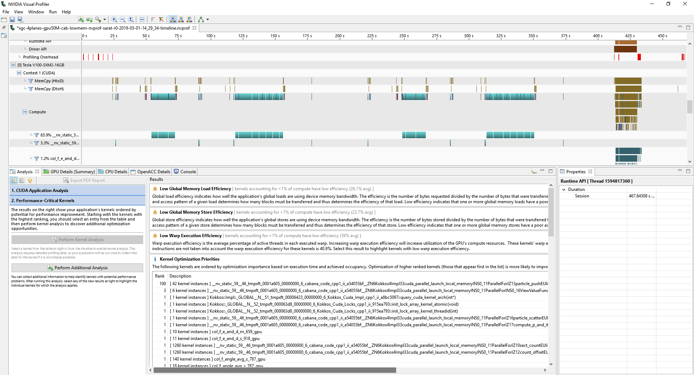
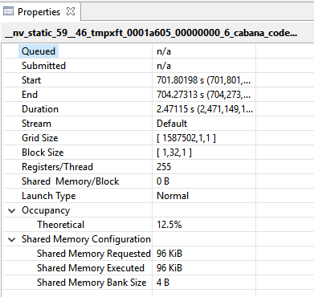
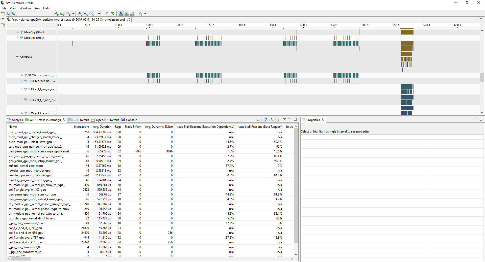
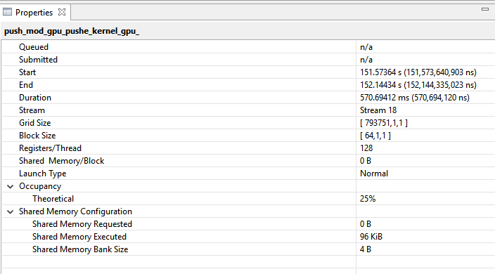

# GPU Kernel Analysis on Summit

## Cabana




[Analysis metrics: All kernels](files/analysis-cab-lowmem-r0.txt`) 


Highlights:
```
       warp_execution_efficiency                                        Warp Execution Efficiency      89.69%
                  gld_throughput                                           Global Load Throughput  636.79GB/s
                  gst_throughput                                          Global Store Throughput  6.1265GB/s
            dram_read_throughput                                    Device Memory Read Throughput  221.29GB/s
           dram_write_throughput                                   Device Memory Write Throughput  370.09GB/s
                  gld_efficiency                                    Global Memory Load Efficiency      24.53%
                  gst_efficiency                                   Global Memory Store Efficiency      25.00%

```
***

Main Kernel:


```
    Kernel: __nv_static_59__46_tmpxft_0001a605_00000000_6_cabana_code_cpp1_ii_a54055bf__ZN6Kokkos4Impl33cuda_parallel_launch_local_memoryINS0_11ParallelForIZ13particle_pushEUliE_NS_11RangePolicyIJNS_4CudaEEEES5_EEEEvT_
          1                 warp_execution_efficiency                                        Warp Execution Efficiency      89.69%      89.69%      89.69%
          1         warp_nonpred_execution_efficiency                         Warp Non-Predicated Execution Efficiency      86.72%      86.72%      86.72%
          1                 shared_store_transactions                                        Shared Store Transactions           0           0           0
          1                  shared_load_transactions                                         Shared Load Transactions           0           0           0
          1                   local_load_transactions                                          Local Load Transactions  3.3255e+10  3.3255e+10  3.3255e+10
          1                  local_store_transactions                                         Local Store Transactions  3.6181e+10  3.6181e+10  3.6181e+10
          1                          gld_transactions                                         Global Load Transactions  5.2801e+10  5.2801e+10  5.2801e+10
          1                          gst_transactions                                        Global Store Transactions   508000600   508000600   508000600
          1                  sysmem_read_transactions                                  System Memory Read Transactions           0           0           0
          1                 sysmem_write_transactions                                 System Memory Write Transactions           5           5           5
          1                      l2_read_transactions                                             L2 Read Transactions  2.3313e+10  2.3313e+10  2.3313e+10
          1                     l2_write_transactions                                            L2 Write Transactions  3.6819e+10  3.6819e+10  3.6819e+10
          1                    dram_read_transactions                                  Device Memory Read Transactions  1.8349e+10  1.8349e+10  1.8349e+10
          1                   dram_write_transactions                                 Device Memory Write Transactions  3.0687e+10  3.0687e+10  3.0687e+10
          1                            gld_throughput                                           Global Load Throughput  636.79GB/s  636.79GB/s  636.79GB/s
          1                            gst_throughput                                          Global Store Throughput  6.1265GB/s  6.1265GB/s  6.1265GB/s
          1                     local_memory_overhead                                            Local Memory Overhead      96.89%      96.89%      96.89%
          1                        tex_cache_hit_rate                                           Unified Cache Hit Rate      52.71%      52.71%      52.71%
          1                      dram_read_throughput                                    Device Memory Read Throughput  221.29GB/s  221.29GB/s  221.29GB/s
          1                     dram_write_throughput                                   Device Memory Write Throughput  370.09GB/s  370.09GB/s  370.09GB/s
          1                      tex_cache_throughput                       Unified cache to Multiprocessor throughput  2503.3GB/s  2503.3GB/s  2503.3GB/s
          1                    l2_tex_read_throughput                                    L2 Throughput (Texture Reads)  257.79GB/s  257.79GB/s  257.79GB/s
          1                   l2_tex_write_throughput                                   L2 Throughput (Texture Writes)  442.47GB/s  442.47GB/s  442.47GB/s
          1                        l2_read_throughput                                            L2 Throughput (Reads)  281.16GB/s  281.16GB/s  281.16GB/s
          1                       l2_write_throughput                                           L2 Throughput (Writes)  444.04GB/s  444.04GB/s  444.04GB/s
          1                    sysmem_read_throughput                                    System Memory Read Throughput  0.00000B/s  0.00000B/s  0.00000B/s
          1                   sysmem_write_throughput                                   System Memory Write Throughput  64.0000B/s  64.0000B/s  63.0000B/s
          1                     local_load_throughput                                     Local Memory Load Throughput  401.06GB/s  401.06GB/s  401.06GB/s
          1                    local_store_throughput                                    Local Memory Store Throughput  436.34GB/s  436.34GB/s  436.34GB/s
          1                    shared_load_throughput                                    Shared Memory Load Throughput  0.00000B/s  0.00000B/s  0.00000B/s
          1                   shared_store_throughput                                   Shared Memory Store Throughput  0.00000B/s  0.00000B/s  0.00000B/s
          1                            gld_efficiency                                    Global Memory Load Efficiency      24.53%      24.53%      24.53%
          1                            gst_efficiency                                   Global Memory Store Efficiency      25.00%      25.00%      25.00%
          1                    tex_cache_transactions                     Unified cache to Multiprocessor transactions  5.1892e+10  5.1892e+10  5.1892e+10
          1                         flop_count_dp_add                  Floating Point Operations(Double Precision Add)  2.7319e+11  2.7319e+11  2.7319e+11
          1                         flop_count_dp_fma                  Floating Point Operations(Double Precision FMA)  8.1962e+11  8.1962e+11  8.1962e+11
          1                         flop_count_dp_mul                  Floating Point Operations(Double Precision Mul)  3.4196e+11  3.4196e+11  3.4196e+11
          1                         flop_count_sp_add                  Floating Point Operations(Single Precision Add)           0           0           0
          1                         flop_count_sp_fma                  Floating Point Operations(Single Precision FMA)  5.6236e+10  5.6236e+10  5.6236e+10
          1                         flop_count_sp_mul                   Floating Point Operation(Single Precision Mul)  1320801560  1320801560  1320801560
          1                     flop_count_sp_special              Floating Point Operations(Single Precision Special)  6.5634e+10  6.5634e+10  6.5634e+10
          1                             inst_executed                                            Instructions Executed  1.5992e+11  1.5992e+11  1.5992e+11
          1                               inst_issued                                              Instructions Issued  1.6001e+11  1.6001e+11  1.6001e+11
          1                          dram_utilization                                        Device Memory Utilization    High (8)    High (8)    High (8)
          1                        sysmem_utilization                                        System Memory Utilization     Low (1)     Low (1)     Low (1)
          1                          stall_inst_fetch                         Issue Stall Reasons (Instructions Fetch)      47.62%      47.62%      47.62%
          1                     stall_exec_dependency                       Issue Stall Reasons (Execution Dependency)      22.52%      22.52%      22.52%
          1                   stall_memory_dependency                               Issue Stall Reasons (Data Request)      25.90%      25.90%      25.90%
          1                             stall_texture                                    Issue Stall Reasons (Texture)       0.00%       0.00%       0.00%
          1                                stall_sync                            Issue Stall Reasons (Synchronization)       0.00%       0.00%       0.00%
          1                               stall_other                                      Issue Stall Reasons (Other)       1.12%       1.12%       1.12%
          1          stall_constant_memory_dependency                         Issue Stall Reasons (Immediate constant)       0.05%       0.05%       0.05%
          1                           stall_pipe_busy                                  Issue Stall Reasons (Pipe Busy)       0.87%       0.87%       0.87%
          1                         shared_efficiency                                         Shared Memory Efficiency       0.00%       0.00%       0.00%
          1                                inst_fp_32                                          FP Instructions(Single)  4.0650e+11  4.0650e+11  4.0650e+11
          1                                inst_fp_64                                          FP Instructions(Double)  1.5991e+12  1.5991e+12  1.5991e+12
          1                              inst_integer                                             Integer Instructions  1.0457e+12  1.0457e+12  1.0457e+12
          1                          inst_bit_convert                                         Bit-Convert Instructions  7.8651e+10  7.8651e+10  7.8651e+10
          1                              inst_control                                        Control-Flow Instructions  2.5744e+11  2.5744e+11  2.5744e+11
          1                        inst_compute_ld_st                                          Load/Store Instructions  8.5243e+11  8.5243e+11  8.5243e+11
          1                                 inst_misc                                                Misc Instructions  1.9780e+11  1.9780e+11  1.9780e+11
          1           inst_inter_thread_communication                                        Inter-Thread Instructions           0           0           0
          1                               issue_slots                                                      Issue Slots  1.6001e+11  1.6001e+11  1.6001e+11
          1                                 cf_issued                                 Issued Control-Flow Instructions  9877961505  9877961505  9877961505
          1                               ldst_issued                                   Issued Load/Store Instructions  3.0634e+10  3.0634e+10  3.0634e+10
          1                       atomic_transactions                                              Atomic Transactions           0           0           0
          1                      l2_atomic_throughput                                  L2 Throughput (Atomic requests)  0.00000B/s  0.00000B/s  0.00000B/s
          1                    l2_atomic_transactions                                L2 Transactions (Atomic requests)           0           0           0
          1                  l2_tex_read_transactions                                  L2 Transactions (Texture Reads)  2.1375e+10  2.1375e+10  2.1375e+10
          1                     stall_memory_throttle                            Issue Stall Reasons (Memory Throttle)       1.42%       1.42%       1.42%
          1                        stall_not_selected                               Issue Stall Reasons (Not Selected)       0.50%       0.50%       0.50%
          1                 l2_tex_write_transactions                                 L2 Transactions (Texture Writes)  3.6689e+10  3.6689e+10  3.6689e+10
          1                         flop_count_hp_add                    Floating Point Operations(Half Precision Add)           0           0           0
          1                         flop_count_hp_mul                     Floating Point Operation(Half Precision Mul)           0           0           0
          1                         flop_count_hp_fma                    Floating Point Operations(Half Precision FMA)           0           0           0
          1                                inst_fp_16                                            HP Instructions(Half)           0           0           0
          1                    issue_slot_utilization                                           Issue Slot Utilization      13.16%      13.16%      13.16%
          1              sm_efficiency (80 instances)                                          Multiprocessor Activity           -           -  [     99.99%     99.99%     99.99%     99.99%     99.99%     99.99%     99.99%    100.00%     99.99%     99.99%    100.00%     99.99%     99.99%     99.99%     99.99%     99.99%     99.99%    100.00%    100.00%     99.99%     99.99%     99.99%    100.00%     99.99%    100.00%    100.00%     99.99%     99.99%     99.99%     99.99%     99.99%     99.99%    100.00%    100.00%     99.99%     99.99%     99.99%    100.00%    100.00%    100.00%     99.99%     99.99%     99.99%    100.00%    100.00%    100.00%    100.00%    100.00%     99.99%    100.00%    100.00%     99.99%     99.99%     99.99%    100.00%     99.99%     99.99%     99.99%     99.99%     99.99%     99.99%     99.99%    100.00%    100.00%    100.00%     99.99%    100.00%    100.00%    100.00%    100.00%     99.99%     99.99%    100.00%    100.00%     99.99%     99.99%     99.99%     99.99%    100.00%    100.00% ]
          1                        achieved_occupancy                                               Achieved Occupancy    0.123716    0.123716    0.123716
          1                        shared_utilization                                        Shared Memory Utilization    Idle (0)    Idle (0)    Idle (0)
          1                            l2_utilization                                             L2 Cache Utilization     Low (2)     Low (2)     Low (2)
          1                           tex_utilization                                        Unified Cache Utilization     Low (2)     Low (2)     Low (2)
          1                       ldst_fu_utilization                             Load/Store Function Unit Utilization     Low (2)     Low (2)     Low (2)
          1                         cf_fu_utilization                           Control-Flow Function Unit Utilization     Low (1)     Low (1)     Low (1)
          1                        tex_fu_utilization                                Texture Function Unit Utilization    Idle (0)    Idle (0)    Idle (0)
          1                    special_fu_utilization                                Special Function Unit Utilization     Low (1)     Low (1)     Low (1)
          1             half_precision_fu_utilization                         Half-Precision Function Unit Utilization    Idle (0)    Idle (0)    Idle (0)
          1           single_precision_fu_utilization                       Single-Precision Function Unit Utilization     Low (1)     Low (1)     Low (1)
          1           double_precision_fu_utilization                       Double-Precision Function Unit Utilization     Low (2)     Low (2)     Low (2)
          1                inst_executed_global_loads                         Warp level instructions for global loads  1.5138e+10  1.5138e+10  1.5138e+10
          1                 inst_executed_local_loads                          Warp level instructions for local loads  8313747974  8313747974  8313747974
          1                inst_executed_shared_loads                         Warp level instructions for shared loads           0           0           0
          1               inst_executed_surface_loads                        Warp level instructions for surface loads           0           0           0
          1               inst_executed_global_stores                        Warp level instructions for global stores    15875020    15875020    15875020
          1                inst_executed_local_stores                         Warp level instructions for local stores  9157180901  9157180901  9157180901
          1               inst_executed_shared_stores                        Warp level instructions for shared stores           0           0           0
          1              inst_executed_surface_stores                       Warp level instructions for surface stores           0           0           0
          1              inst_executed_global_atomics             Warp level instructions for global atom and atom cas           0           0           0
          1           inst_executed_global_reductions                    Warp level instructions for global reductions           0           0           0
          1             inst_executed_surface_atomics            Warp level instructions for surface atom and atom cas           0           0           0
          1          inst_executed_surface_reductions                   Warp level instructions for surface reductions           0           0           0
          1              inst_executed_shared_atomics             Warp level shared instructions for atom and atom CAS           0           0           0
          1                     inst_executed_tex_ops                              Warp level instructions for texture           0           0           0
          1                           dram_read_bytes                           Total bytes read from DRAM to L2 cache  5.8717e+11  5.8717e+11  5.8717e+11
          1                          dram_write_bytes                        Total bytes written from L2 cache to DRAM  9.8198e+11  9.8198e+11  9.8198e+11
          1                      global_load_requests         Total number of global load requests from Multiprocessor  1.5138e+10  1.5138e+10  1.5138e+10
          1                       local_load_requests          Total number of local load requests from Multiprocessor  8313747974  8313747974  8313747974
          1                     surface_load_requests        Total number of surface load requests from Multiprocessor           0           0           0
          1                    surface_store_requests       Total number of surface store requests from Multiprocessor           0           0           0
          1                 global_reduction_requests    Total number of global reduction requests from Multiprocessor           0           0           0
          1                   surface_atomic_requests      Total number of surface atomic requests from Multiprocessor           0           0           0
          1                surface_reduction_requests   Total number of surface reduction requests from Multiprocessor           0           0           0
          1                      l2_global_load_bytes             Bytes read from L2 for misses in L1 for global loads  5.6189e+10  5.6189e+10  5.6189e+10
          1                       l2_local_load_bytes              Bytes read from L2 for misses in L1 for local loads  6.2613e+11  6.2613e+11  6.2613e+11
          1                     l2_surface_load_bytes            Bytes read from L2 for misses in L1 for surface loads           0           0           0
          1              l2_global_atomic_store_bytes                   Bytes written to L2 from L1 for global atomics           0           0           0
          1                    l2_surface_store_bytes           Bytes read from L2 for misses in L1 for surface stores           0           0           0
          1                         sysmem_read_bytes                                         System Memory Read Bytes           0           0           0
          1                        sysmem_write_bytes                                        System Memory Write Bytes         160         160         160
          1                           l2_tex_hit_rate                                                L2 Cache Hit Rate      24.81%      24.81%      24.81%
          1                     texture_load_requests        Total number of texture Load requests from Multiprocessor           0           0           0
 
```

## CUDA Fortran





[Analysis metrics: All kernels](files/analysis-cudaftn-r0.txt) 

Highlights:
```
       warp_execution_efficiency                                        Warp Execution Efficiency      92.98%
                  gld_throughput                                           Global Load Throughput  25.006GB/s
                  gst_throughput                                          Global Store Throughput  8.3244GB/s
            dram_read_throughput                                    Device Memory Read Throughput  95.021GB/s
           dram_write_throughput                                   Device Memory Write Throughput  348.82GB/s
                  gld_efficiency                                    Global Memory Load Efficiency      58.54%
                  gst_efficiency                                   Global Memory Store Efficiency     100.00%
```


Main Kernel:

```
    Kernel: push_mod_gpu_pushe_kernel_gpu_
          1                 warp_execution_efficiency                                        Warp Execution Efficiency      92.98%      92.98%      92.98%
          1         warp_nonpred_execution_efficiency                         Warp Non-Predicated Execution Efficiency      91.62%      91.62%      91.62%
          1                 shared_store_transactions                                        Shared Store Transactions           0           0           0
          1                  shared_load_transactions                                         Shared Load Transactions           0           0           0
          1                   local_load_transactions                                          Local Load Transactions  9510493925  9510493925  9510493925
          1                  local_store_transactions                                         Local Store Transactions  9461524806  9461524806  9461524806
          1                          gld_transactions                                         Global Load Transactions   476883583   476883583   476883583
          1                          gst_transactions                                        Global Store Transactions   158750188   158750188   158750188
          1                  sysmem_read_transactions                                  System Memory Read Transactions           0           0           0
          1                 sysmem_write_transactions                                 System Memory Write Transactions           5           5           5
          1                      l2_read_transactions                                             L2 Read Transactions  4988804445  4988804445  4988804445
          1                     l2_write_transactions                                            L2 Write Transactions  9626838529  9626838529  9626838529
          1                    dram_read_transactions                                  Device Memory Read Transactions  1812095770  1812095770  1812095770
          1                   dram_write_transactions                                 Device Memory Write Transactions  6652161600  6652161600  6652161600
          1                            gld_throughput                                           Global Load Throughput  25.006GB/s  25.006GB/s  25.006GB/s
          1                            gst_throughput                                          Global Store Throughput  8.3244GB/s  8.3244GB/s  8.3244GB/s
          1                     local_memory_overhead                                            Local Memory Overhead      96.48%      96.48%      96.48%
          1                        tex_cache_hit_rate                                           Unified Cache Hit Rate      66.93%      66.93%      66.93%
          1                      dram_read_throughput                                    Device Memory Read Throughput  95.021GB/s  95.021GB/s  95.021GB/s
          1                     dram_write_throughput                                   Device Memory Write Throughput  348.82GB/s  348.82GB/s  348.82GB/s
          1                      tex_cache_throughput                       Unified cache to Multiprocessor throughput  2072.6GB/s  2072.6GB/s  2072.6GB/s
          1                    l2_tex_read_throughput                                    L2 Throughput (Texture Reads)  111.39GB/s  111.39GB/s  111.39GB/s
          1                   l2_tex_write_throughput                                   L2 Throughput (Texture Writes)  504.46GB/s  504.46GB/s  504.46GB/s
          1                        l2_read_throughput                                            L2 Throughput (Reads)  261.60GB/s  261.60GB/s  261.60GB/s
          1                       l2_write_throughput                                           L2 Throughput (Writes)  504.80GB/s  504.80GB/s  504.80GB/s
          1                    sysmem_read_throughput                                    System Memory Read Throughput  0.00000B/s  0.00000B/s  0.00000B/s
          1                   sysmem_write_throughput                                   System Memory Write Throughput  281.000B/s  281.000B/s  280.000B/s
          1                     local_load_throughput                                     Local Memory Load Throughput  498.70GB/s  498.70GB/s  498.70GB/s
          1                    local_store_throughput                                    Local Memory Store Throughput  496.14GB/s  496.14GB/s  496.14GB/s
          1                    shared_load_throughput                                    Shared Memory Load Throughput  0.00000B/s  0.00000B/s  0.00000B/s
          1                   shared_store_throughput                                   Shared Memory Store Throughput  0.00000B/s  0.00000B/s  0.00000B/s
          1                            gld_efficiency                                    Global Memory Load Efficiency      58.54%      58.54%      58.54%
          1                            gst_efficiency                                   Global Memory Store Efficiency     100.00%     100.00%     100.00%
          1                    tex_cache_transactions                     Unified cache to Multiprocessor transactions  1.6819e+10  1.6819e+10  1.6819e+10
          1                         flop_count_dp_add                  Floating Point Operations(Double Precision Add)  4.2669e+10  4.2669e+10  4.2669e+10
          1                         flop_count_dp_fma                  Floating Point Operations(Double Precision FMA)  1.6500e+11  1.6500e+11  1.6500e+11
          1                         flop_count_dp_mul                  Floating Point Operations(Double Precision Mul)  6.7097e+10  6.7097e+10  6.7097e+10
          1                         flop_count_sp_add                  Floating Point Operations(Single Precision Add)           0           0           0
          1                         flop_count_sp_fma                  Floating Point Operations(Single Precision FMA)  1.2243e+10  1.2243e+10  1.2243e+10
          1                         flop_count_sp_mul                   Floating Point Operation(Single Precision Mul)           0           0           0
          1                     flop_count_sp_special              Floating Point Operations(Single Precision Special)  1.4224e+10  1.4224e+10  1.4224e+10
          1                             inst_executed                                            Instructions Executed  3.4258e+10  3.4258e+10  3.4258e+10
          1                               inst_issued                                              Instructions Issued  3.4700e+10  3.4700e+10  3.4700e+10
          1                          dram_utilization                                        Device Memory Utilization     Mid (6)     Mid (6)     Mid (6)
          1                        sysmem_utilization                                        System Memory Utilization     Low (1)     Low (1)     Low (1)
          1                          stall_inst_fetch                         Issue Stall Reasons (Instructions Fetch)      62.54%      62.54%      62.54%
          1                     stall_exec_dependency                       Issue Stall Reasons (Execution Dependency)       9.23%       9.23%       9.23%
          1                   stall_memory_dependency                               Issue Stall Reasons (Data Request)      19.04%      19.04%      19.04%
          1                             stall_texture                                    Issue Stall Reasons (Texture)       2.93%       2.93%       2.93%
          1                                stall_sync                            Issue Stall Reasons (Synchronization)       0.00%       0.00%       0.00%
          1                               stall_other                                      Issue Stall Reasons (Other)       0.13%       0.13%       0.13%
          1          stall_constant_memory_dependency                         Issue Stall Reasons (Immediate constant)       4.35%       4.35%       4.35%
          1                           stall_pipe_busy                                  Issue Stall Reasons (Pipe Busy)       0.52%       0.52%       0.52%
          1                         shared_efficiency                                         Shared Memory Efficiency       0.00%       0.00%       0.00%
          1                                inst_fp_32                                          FP Instructions(Single)  7.1263e+10  7.1263e+10  7.1263e+10
          1                                inst_fp_64                                          FP Instructions(Double)  3.0337e+11  3.0337e+11  3.0337e+11
          1                              inst_integer                                             Integer Instructions  2.5735e+11  2.5735e+11  2.5735e+11
          1                          inst_bit_convert                                         Bit-Convert Instructions  1.3880e+10  1.3880e+10  1.3880e+10
          1                              inst_control                                        Control-Flow Instructions  6.7729e+10  6.7729e+10  6.7729e+10
          1                        inst_compute_ld_st                                          Load/Store Instructions  1.6911e+11  1.6911e+11  1.6911e+11
          1                                 inst_misc                                                Misc Instructions  1.2164e+11  1.2164e+11  1.2164e+11
          1           inst_inter_thread_communication                                        Inter-Thread Instructions           0           0           0
          1                               issue_slots                                                      Issue Slots  3.4700e+10  3.4700e+10  3.4700e+10
          1                                 cf_issued                                 Issued Control-Flow Instructions  2459091838  2459091838  2459091838
          1                               ldst_issued                                   Issued Load/Store Instructions  6035432168  6035432168  6035432168
          1                       atomic_transactions                                              Atomic Transactions           0           0           0
          1                      l2_atomic_throughput                                  L2 Throughput (Atomic requests)  0.00000B/s  0.00000B/s  0.00000B/s
          1                    l2_atomic_transactions                                L2 Transactions (Atomic requests)           0           0           0
          1                  l2_tex_read_transactions                                  L2 Transactions (Texture Reads)  2124278909  2124278909  2124278909
          1                     stall_memory_throttle                            Issue Stall Reasons (Memory Throttle)       0.86%       0.86%       0.86%
          1                        stall_not_selected                               Issue Stall Reasons (Not Selected)       0.41%       0.41%       0.41%
          1                 l2_tex_write_transactions                                 L2 Transactions (Texture Writes)  9620274994  9620274994  9620274994
          1                         flop_count_hp_add                    Floating Point Operations(Half Precision Add)           0           0           0
          1                         flop_count_hp_mul                     Floating Point Operation(Half Precision Mul)           0           0           0
          1                         flop_count_hp_fma                    Floating Point Operations(Half Precision FMA)           0           0           0
          1                                inst_fp_16                                            HP Instructions(Half)           0           0           0
          1                    issue_slot_utilization                                           Issue Slot Utilization      12.42%      12.42%      12.42%
          1              sm_efficiency (80 instances)                                          Multiprocessor Activity           -           -  [     99.99%     99.98%    100.00%     99.99%     99.99%     99.98%     99.98%     99.99%     99.99%     99.99%     99.99%    100.00%     99.99%    100.00%     99.99%     99.99%    100.00%     99.99%     99.99%     99.99%     99.99%    100.00%     99.98%     99.99%     99.99%     99.99%     99.99%    100.00%     99.99%     99.98%     99.98%     99.99%     99.99%     99.99%    100.00%     99.99%     99.98%     99.99%     99.99%    100.00%     99.99%     99.99%     99.99%     99.99%     99.99%     99.99%     99.99%     99.99%     99.99%     99.99%     99.99%    100.00%     99.99%     99.99%     99.98%     99.98%     99.99%     99.99%     99.99%    100.00%     99.99%     99.99%    100.00%    100.00%     99.98%     99.99%     99.99%     99.99%     99.98%     99.99%     99.99%     99.99%     99.99%     99.99%    100.00%    100.00%     99.99%    100.00%     99.99%     99.99% ]
          1                        achieved_occupancy                                               Achieved Occupancy    0.236456    0.236456    0.236456
          1                        shared_utilization                                        Shared Memory Utilization    Idle (0)    Idle (0)    Idle (0)
          1                            l2_utilization                                             L2 Cache Utilization     Low (2)     Low (2)     Low (2)
          1                           tex_utilization                                        Unified Cache Utilization     Low (1)     Low (1)     Low (1)
          1                       ldst_fu_utilization                             Load/Store Function Unit Utilization     Low (1)     Low (1)     Low (1)
          1                         cf_fu_utilization                           Control-Flow Function Unit Utilization     Low (1)     Low (1)     Low (1)
          1                        tex_fu_utilization                                Texture Function Unit Utilization     Low (3)     Low (3)     Low (3)
          1                    special_fu_utilization                                Special Function Unit Utilization     Low (1)     Low (1)     Low (1)
          1             half_precision_fu_utilization                         Half-Precision Function Unit Utilization    Idle (0)    Idle (0)    Idle (0)
          1           single_precision_fu_utilization                       Single-Precision Function Unit Utilization     Low (1)     Low (1)     Low (1)
          1           double_precision_fu_utilization                       Double-Precision Function Unit Utilization     Low (2)     Low (2)     Low (2)
          1                inst_executed_global_loads                         Warp level instructions for global loads   169862714   169862714   169862714
          1                 inst_executed_local_loads                          Warp level instructions for local loads  2518787407  2518787407  2518787407
          1                inst_executed_shared_loads                         Warp level instructions for shared loads           0           0           0
          1               inst_executed_surface_loads                        Warp level instructions for surface loads           0           0           0
          1               inst_executed_global_stores                        Warp level instructions for global stores    20637526    20637526    20637526
          1                inst_executed_local_stores                         Warp level instructions for local stores  2573525554  2573525554  2573525554
          1               inst_executed_shared_stores                        Warp level instructions for shared stores           0           0           0
          1              inst_executed_surface_stores                       Warp level instructions for surface stores           0           0           0
          1              inst_executed_global_atomics             Warp level instructions for global atom and atom cas           0           0           0
          1           inst_executed_global_reductions                    Warp level instructions for global reductions           0           0           0
          1             inst_executed_surface_atomics            Warp level instructions for surface atom and atom cas           0           0           0
          1          inst_executed_surface_reductions                   Warp level instructions for surface reductions           0           0           0
          1              inst_executed_shared_atomics             Warp level shared instructions for atom and atom CAS           0           0           0
          1                     inst_executed_tex_ops                              Warp level instructions for texture  2023279849  2023279849  2023279849
          1                           dram_read_bytes                           Total bytes read from DRAM to L2 cache  5.7987e+10  5.7987e+10  5.7987e+10
          1                          dram_write_bytes                        Total bytes written from L2 cache to DRAM  2.1287e+11  2.1287e+11  2.1287e+11
          1                      global_load_requests         Total number of global load requests from Multiprocessor   169862714   169862714   169862714
          1                       local_load_requests          Total number of local load requests from Multiprocessor  2518787407  2518787407  2518787407
          1                     surface_load_requests        Total number of surface load requests from Multiprocessor           0           0           0
          1                    surface_store_requests       Total number of surface store requests from Multiprocessor           0           0           0
          1                 global_reduction_requests    Total number of global reduction requests from Multiprocessor           0           0           0
          1                   surface_atomic_requests      Total number of surface atomic requests from Multiprocessor           0           0           0
          1                surface_reduction_requests   Total number of surface reduction requests from Multiprocessor           0           0           0
          1                      l2_global_load_bytes             Bytes read from L2 for misses in L1 for global loads  5297052320  5297052320  5297052320
          1                       l2_local_load_bytes              Bytes read from L2 for misses in L1 for local loads  5.9244e+10  5.9244e+10  5.9244e+10
          1                     l2_surface_load_bytes            Bytes read from L2 for misses in L1 for surface loads           0           0           0
          1              l2_global_atomic_store_bytes                   Bytes written to L2 from L1 for global atomics           0           0           0
          1                    l2_surface_store_bytes           Bytes read from L2 for misses in L1 for surface stores           0           0           0
          1                         sysmem_read_bytes                                         System Memory Read Bytes           0           0           0
          1                        sysmem_write_bytes                                        System Memory Write Bytes         160         160         160
          1                           l2_tex_hit_rate                                                L2 Cache Hit Rate      48.66%      48.66%      48.66%
          1                     texture_load_requests        Total number of texture Load requests from Multiprocessor  1.3875e+10  1.3875e+10  1.3875e+10
 
```

## Comparison: Push kernel (Cabana vs. CUDA)
                                                                                                  Cabana-push   CUDA-push
***
       warp_execution_efficiency                                        Warp Execution Efficiency      89.69%      92.98%
                  gld_throughput                                           Global Load Throughput  636.79GB/s  25.006GB/s
                  gst_throughput                                          Global Store Throughput  6.1265GB/s  8.3244GB/s
            dram_read_throughput                                    Device Memory Read Throughput  221.29GB/s  95.021GB/s
           dram_write_throughput                                   Device Memory Write Throughput  370.09GB/s  348.82GB/s
                  gld_efficiency                                    Global Memory Load Efficiency      24.53%      58.54%
                  gst_efficiency                                   Global Memory Store Efficiency      25.00%     100.00%
***


