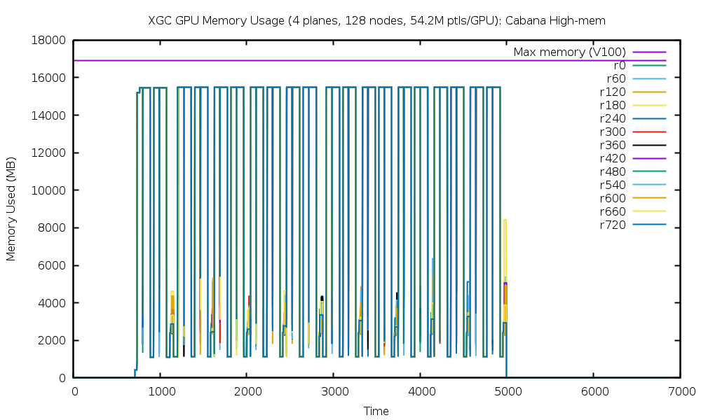
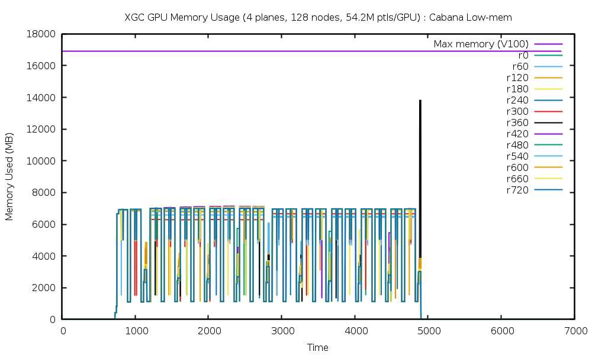

# Performance Analysis on Summit

## GPU Memory Usage

Existing tools like nvprof do not have the ability to easily identify GPU high-memory watermark. Hence, memory utilzation data is gathered through Nvidia device monitoring tools and plotted over duration of application execution. 


**Problem configuration:**
* Num. planes: 4 
* Num. nodes: 128
* Num. MPI processes: 768
* Num. OMP threads: 14
* Particles/rank: 54.2 M
* Code: XGC-Devel master 
**	Cabana-highmem(04/24): Git HEAD commit ID:  6fb1be316a5da75097dd45960af59257119fe753
**	CUDA Fortran  (04/24): Git HEAD commit ID:  6fb1be316a5da75097dd45960af59257119fe753
**	Cabana-lowmem (04/30): Git HEAD commit ID:  e66e44cf99491c4a9fa4e15732c99f625440a52c
* Memory tracking was done for 20 time steps.

### Comparison across versions
The following plot shows memory usage of rank 0 (GPU 0 on first node) for all XGC variants.


***

**Note: **
The following plots show memory usage for several MPI ranks where samples are collected from one GPU for every 10 nodes (60 MPI ranks).

### Cabana High-memory version: GPU Memory Usage


[Timing Stats](files/cabana-highmem/timing_all.txt_stats) 


### Cabana Low-memory version: GPU Memory Usage


[Timing Stats](files/cabana-lowmem/timing_all.txt_stats) 

### CUDA Fortran version: GPU Memory Usage


[Timing Stats](files/cudaftn/timing_all.txt_stats) 


***

## GPU profiling using Nvprof
  
Profiling was done with 2 time steps. 

### Cabana Low-memory version
[Full Profile](files/report-xgc-cab-lowmem.txt) 

Overview: 
```
======== Profiling result: 
            Type  Time(%)      Time     Calls       Avg       Min       Max  Name 
 GPU activities:   79.75%  102.842s        42  2.44862s  2.41029s  2.47537s  __nv_static_59__46_tmpxft_0001a605_00000000_6_cabana_code_cpp1_ii_a54055bf__ZN6Kokkos4Impl33cuda_parallel_launch_local_memoryINS0_11ParallelForIZ13particle_pushEUliE_NS_11RangePolicyIJNS_4CudaEEEES5_EEEEvT_ 
                    3.16%  4.07333s        12  339.44ms  1.1205ms  679.63ms  __nv_static_59__46_tmpxft_0001a605_00000000_6_cabana_code_cpp1_ii_a54055bf__ZN6Kokkos4Impl33cuda_parallel_launch_local_memoryINS0_11ParallelForINS0_16ViewValueFunctorINS_4CudaEN6Cabana3SoAINS5_11MemberTypesIJA6_dA3_dxEEELi1EEELb0EEENS_11RangePolicyIJS4_EEES4_EEEEvT_ 
                    2.61%  3.36485s     49720  67.676us  1.2800us  351.96ms  [CUDA memcpy DtoH] 
                    2.30%  2.96903s    322914  9.1940us     864ns  325.65ms  [CUDA memcpy HtoD] 
                    1.11%  1.43697s     24820  57.895us  48.863us  401.76us  col_f_e_and_d_m_659_gpu 
                    1.05%  1.36014s     24820  54.800us  51.359us  158.72us  col_f_e_and_d_s_991_gpu 
```

### Cabana High-memory version
[Full Profile](files/report-xgc-cab-nvprof.txt) 

Overview: 
```
======== Profiling result:                                                                                                                                                                                       
            Type  Time(%)      Time     Calls       Avg       Min       Max  Name
 GPU activities:   70.77%  102.599s        42  2.44284s  2.40618s  2.46749s  __nv_static_59__46_tmpxft_0001d062_00000000_6_cabana_code_cpp1_ii_a54055bf__ZN6Kokkos4Impl33cuda_parallel_launch_local_memoryINS0_11ParallelForIZ13particle_pushEUliE_NS_11RangePolicyIJNS_4CudaEEEES5_EEEEvT_
                    8.91%  12.9226s     49708  259.97us  1.2480us  1.72059s  [CUDA memcpy DtoH]
                    6.03%  8.73583s         8  1.09198s  2.2922ms  2.51979s  __nv_static_59__46_tmpxft_0001d062_00000000_6_cabana_code_cpp1_ii_a54055bf__ZN6Kokkos4Impl33cuda_parallel_launch_local_memoryINS0_11ParallelForINS0_16ViewValueFunctorINS_4CudaEN6Cabana3SoAINS5_11MemberTypesIJA6_dA3_dxEEELi1EEELb0EEENS_11RangePolicyIJS4_EEES4_EEEEvT_
                    3.11%  4.51482s    322888  13.982us     864ns  628.50ms  [CUDA memcpy HtoD]
                    3.06%  4.44221s        46  96.570ms  26.354ms  245.43ms  __nv_static_59__46_tmpxft_0001d062_00000000_6_cabana_code_cpp1_ii_a54055bf__ZN6Kokkos4Impl33cuda_parallel_launch_local_memoryINS0_11ParallelForIZ23ptl_to_sorted_tmp_arrayEUliE_NS_11RangePolicyIJNS_4CudaEEEES5_EEEEvT_
                    1.85%  2.68490s        50  53.698ms  53.417ms  54.063ms  __nv_static_59__46_tmpxft_0001d062_00000000_6_cabana_code_cpp1_ii_a54055bf__ZN6Kokkos4Impl33cuda_parallel_launch_local_memoryINS0_11ParallelForIZ16tmp_array_to_ptlEUliE_NS_11RangePolicyIJNS_4CudaEEEES5_EEEEvT_
                    0.99%  1.42985s     24820  57.608us  48.063us  434.72us  col_f_e_and_d_m_659_gpu
```

### Cabana CUDA Fortran version
[Full Profile](files/report-xgc-cudaftn.txt) 

Overview: 
```
======== Profiling result:                                                                                                                                                                                       
            Type  Time(%)      Time     Calls       Avg       Min       Max  Name
 GPU activities:   90.75%  122.719s       210  584.38ms  564.88ms  599.51ms  push_mod_gpu_pushe_kernel_gpu_
                    1.19%  1.60800s       690  2.3304ms  1.6451ms  10.540ms  reorder_gpu_mod_dreorder_gpu_
                    1.06%  1.43266s      2472  579.56us  532.51us  982.01us  col_f_angle_avg_m_102_gpu
                    1.02%  1.37917s     24820  55.566us  51.456us  207.36us  col_f_e_and_d_s_991_gpu
                    0.99%  1.33538s     24820  53.802us  47.679us  214.33us  col_f_e_and_d_m_659_gpu

```
